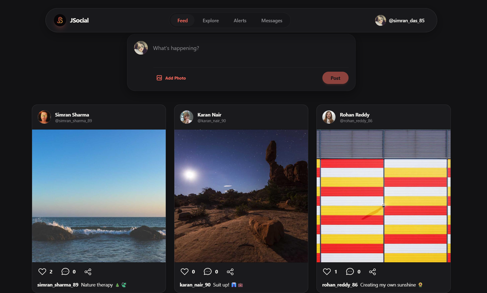

<div align="center">


# JSocial

**A real-time social platform — post, connect, chat, and stay notified, live.**

A full-stack MERN social media application with real-time messaging, live notifications, and a follow-based social graph — built with a deliberate focus on getting the hard parts of real-time systems actually right.

[](https://react.dev)
[](https://nodejs.org)
[](https://www.mongodb.com)
[](https://socket.io)
[](https://redux-toolkit.js.org)
[](https://tailwindcss.com)

**🔴 Live Demo:** [jeesocial.netlify.app](https://jeesocial.netlify.app/)   &nbsp; &nbsp;| &nbsp;   **⚙️ Live API:** [jsocial-z4k5.onrender.com](https://jsocial-z4k5.onrender.com/)



</div>

---

## 🔗 Try It Live

No setup needed to try the app — it's deployed and running:

| | |
|---|---|
| **Frontend (app)** | [https://jeesocial.netlify.app](https://jeesocial.netlify.app/) |
| **Backend (API)** | [https://jsocial-z4k5.onrender.com](https://jsocial-z4k5.onrender.com/) |

> ⚠️ **Cold start notice:** The backend is hosted on Render's free tier, which spins down after inactivity. The **first** request after a period of idleness can take 30–60 seconds to respond while the server wakes up — this is a hosting-tier limitation, not an application bug. Subsequent requests will be fast.

---

## ✨ Features

### 💬 Real-Time Messaging
- One-to-one direct messaging over Socket.IO — messages arrive instantly, no polling
- **Live typing indicators** ("typing…") synced per-conversation
- **Read receipts** — messages flip to "read" in real time on the sender's screen the moment the recipient opens the chat
- **Online presence** — live green-dot indicators wherever a user avatar appears

### 🔔 Live Notifications
- Real-time toast notifications for likes, comments, and follows — no refresh needed
- Persistent notification history with automatic read/unread tracking
- **Deep linking** — tapping a notification opens the exact post via a public, shareable `/post/:id` route, no login required to view

### 📸 Posts & Social Graph
- Image posts with captions, likes, and threaded comments
- Follow / unfollow system with dedicated **followers** and **following** list views
- Explore feed for discovering new content and users
- Shareable public post pages, viewable by anyone with the link

### 🔐 Authentication & Security
- JWT-based auth stored in **httpOnly cookies** — inaccessible to client-side JS, closing off a common XSS token-theft vector
- Correctly configured cross-origin cookies (`sameSite: "none"` + `secure: true`) for a split frontend/backend deployment
- Route protection enforced on both client (guarded routes) and server (auth middleware)

### ⚡ Real-Time Architecture, Done Right
- **Single shared socket per user** via React Context — not a connection-per-component pattern, which eliminates registration race conditions on the backend
- Centralized unread-count state (Redux) instead of scattered local component state or DOM events
- Async-safe server startup — the app only accepts traffic after the database connection is confirmed, never before

---

## 🛠️ Tech Stack

| Layer | Technology |
|---|---|
| Frontend | React (Vite), Redux Toolkit, React Router, Tailwind CSS, Axios |
| Real-time | Socket.IO (client + server) |
| Backend | Node.js, Express |
| Database | MongoDB Atlas + Mongoose |
| Media storage | Cloudinary |
| Auth | JWT, httpOnly cookies |
| Frontend hosting | Netlify — [jeesocial.netlify.app](https://jeesocial.netlify.app/) |
| Backend hosting | Render — [jsocial-z4k5.onrender.com](https://jsocial-z4k5.onrender.com/) *(stateful — required for persistent WebSocket connections)* |

---

## 🏗️ Architecture

```
┌───────────────────────┐         ┌──────────────────────────┐
│   Frontend (Vite)     │◄───────►│   Backend (Express)      │
│   React + Redux       │  HTTPS  │   REST API               │
│   jeesocial.netlify.app        jsocial-z4k5.onrender.com   │
└───────────┬───────────┘         └────────────┬─────────────┘
            │                                  │
            │        WebSocket (Socket.IO)     │
            └──────────────────────────────────┘
                             │
                  ┌──────────▼──────────┐
                  │   MongoDB Atlas     │
                  └─────────────────────┘
                             │
                  ┌──────────▼──────────┐
                  │  Cloudinary (media) │
                  └─────────────────────┘
```

> **Why a stateful host, not serverless?** Socket.IO needs a long-lived WebSocket connection held open across requests — something a serverless function's short-lived invocation model can't provide. The backend is deployed to Render specifically for this reason, not by default.

---

## 🚀 Getting Started

### Option 1 — Just use the live app
Visit **[jeesocial.netlify.app](https://jeesocial.netlify.app/)** — no installation required.

### Option 2 — Run it locally

#### Prerequisites
- Node.js 18+
- A [MongoDB Atlas](https://www.mongodb.com/atlas) cluster (free tier works)
- A [Cloudinary](https://cloudinary.com) account for media uploads

#### Installation

```bash
# 1. Clone the repository
git clone https://github.com/jeetu-programmer7887/jsocial.git
cd jsocial

# 2. Backend
cd Project
npm install
cp .env.example .env

# 3. Frontend
cd ../frontend
npm install
cp .env.example .env
```

#### Environment Variables

**Backend (`Project/.env`):**
```env
MONGO_URI=your_mongodb_connection_string
JWT_SECRET=your_jwt_secret
FRONTEND_URL=http://localhost:5173
CLOUDINARY_CLOUD_NAME=your_cloud_name
CLOUDINARY_API_KEY=your_api_key
CLOUDINARY_API_SECRET=your_api_secret
PORT=5000
NODE_ENV=development
```

**Frontend (`frontend/.env`):**
```env
VITE_backendUrl=http://localhost:3000
```

> 💡 To point your local frontend at the **live** backend instead of running your own, set `VITE_backendUrl=https://jsocial-z4k5.onrender.com`.

#### Running Locally

```bash
# Terminal 1 — backend
cd Project
npm run dev

# Terminal 2 — frontend
cd frontend
npm run dev
```

Open [http://localhost:5173](http://localhost:5173) in your browser.

---

## 📁 Project Structure

```
jsocial/
├── Project/
│   ├── Controller/
│   │   ├── auth.controller.js
│   │   ├── user.controller.js
│   │   ├── post.controller.js
│   │   ├── message.controller.js
│   │   └── notification.controller.js
│   ├── Models/
│   ├── Routes/
│   ├── Middleware/
│   ├── socket/
│   │   └── socket.js          # Single source of truth for real-time events
│   ├── utils/
│   │   ├── db.js
│   │   ├── cloudinary.js
│   │   └── generateToken.js
│   └── server.js
└── frontend/
    ├── src/
    │   ├── components/
    │   │   ├── ChatRoom.jsx
    │   │   ├── Navbar.jsx
    │   │   ├── Alert.jsx
    │   │   └── PostFeed.jsx
    │   │   └── etc. files
    │   ├── pages/
    │   │   ├── Home.jsx
    │   │   ├── Explore.jsx
    │   │   ├── Message.jsx
    │   │   └── PostPage.jsx
    │   │   └── etc. files
    │   ├── Layout/
    │   │   └── SocketContext.jsx   # Single shared socket instance
    │   ├── redux/
    │   └── App.jsx
    └── vite.config.js
```

---

## 🧠 Engineering Highlights

A few real problems solved during development that go beyond a standard feature checklist:

- **Diagnosed a socket race condition** causing intermittent, hard-to-reproduce notification failures — two independent Socket.IO connections were competing to register the same user on a single-slot backend map, silently overwriting each other. Fixed by consolidating to one shared socket instance per user via Context.
- **Fixed cross-domain cookie auth** between a Netlify frontend and Render backend, correctly pairing `sameSite: "none"` with `secure: true` — a combination that fails silently, not loudly, when misconfigured.
- **Eliminated a split-brain unread-count bug**, where the message badge was driven by two unsynchronized sources (a raw DOM event and a local socket counter), by consolidating both into a single Redux-backed source of truth.
- **Chose deployment topology deliberately** — migrated the backend off serverless after identifying that persistent WebSocket connections are fundamentally incompatible with short-lived function invocations.

---
